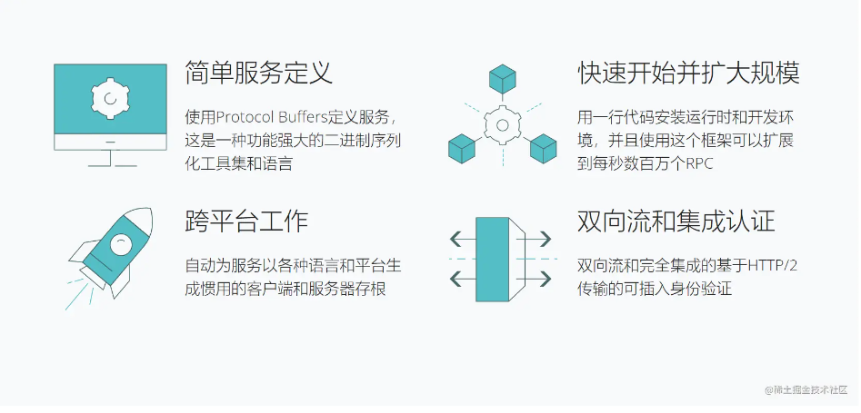
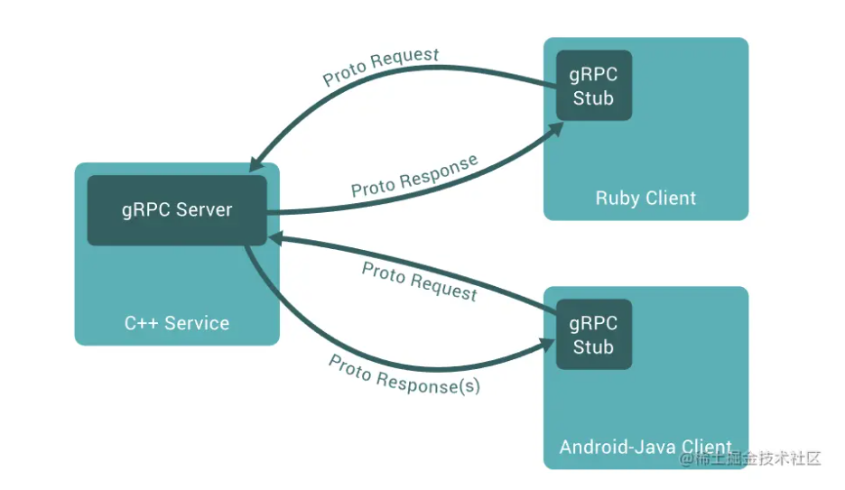
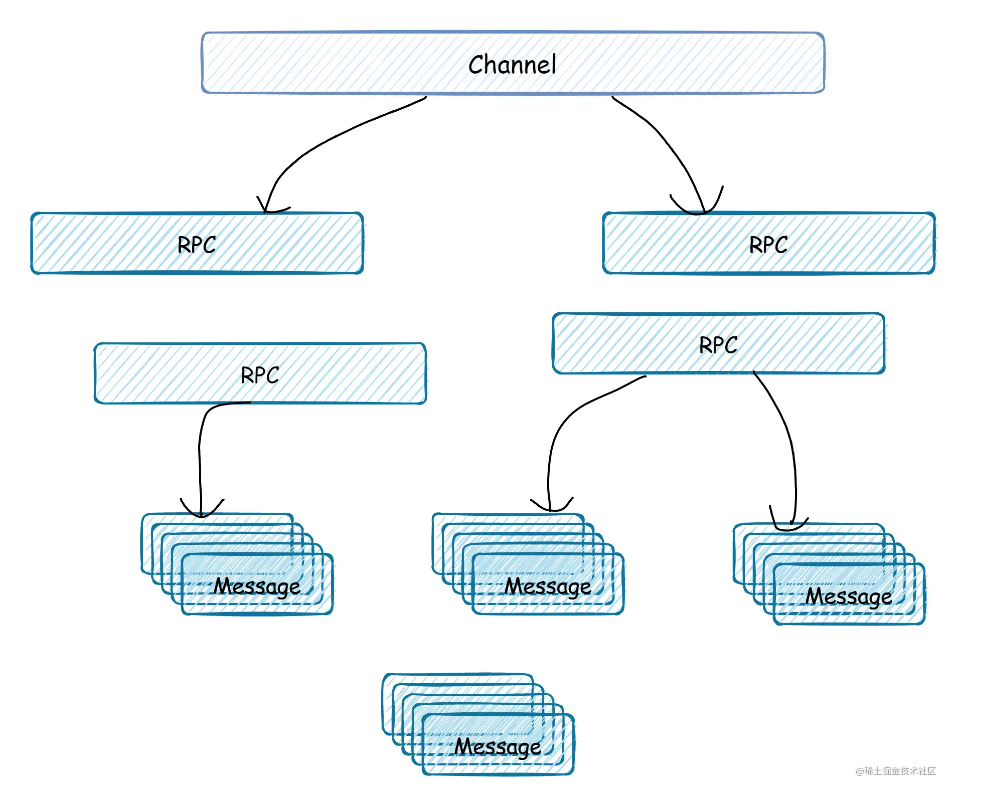
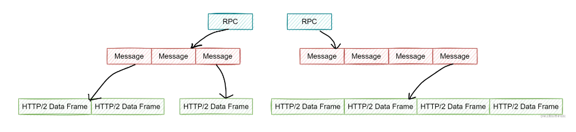
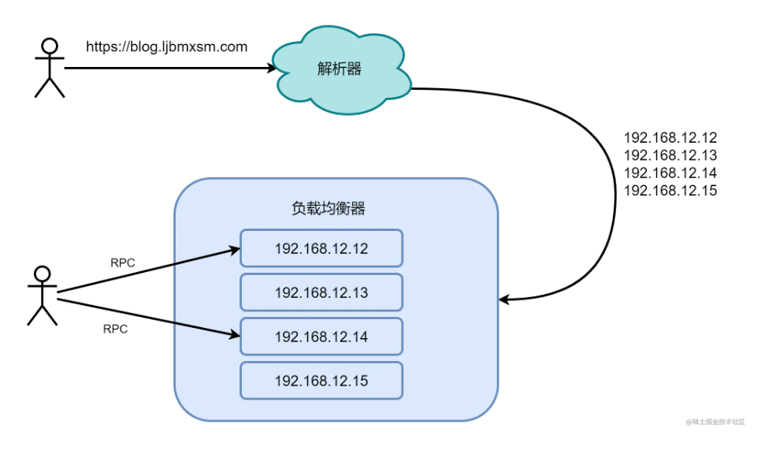

gRPC与服务器开发基础

这里需要一点服务器开的基础（C10K问题），了解TCP与HTTP的关系，I/O模型， I/O多路复用，Recator模式，多线程与线程池。

可以参考这篇里面设计的网络、操作系统以及编程上的一些概念：https://zhuanlan.zhihu.com/p/364044293

# gRPC的下载和编译

## 方案一

https://pj-x86.github.io/2020/grpc%E6%BA%90%E7%A0%81%E4%B8%8B%E8%BD%BD%E5%8A%A0%E9%80%9F/

大体上根据这篇博客来的

- 可通过 gitee.com 先下载 grpc 主框架源码

  ```shell
  git clone git@gitee.com:mirrors/grpc.git
  ```

  

- 修改 grpc 依赖的第三方库下载地址。进入前面下载的 grpc 主框架源码目录，修改 .gitmodules ，只需修改其中的 url 参数，其他保持不变，注意并非每个第三方库都在 gitee.com 上有镜像仓库，没有的保持不变。参考如下：

  ```
  [submodule "third_party/zlib"]
          path = third_party/zlib
          #url = https://github.com/madler/zlib.git
          url = https://gitee.com/mirrors/zlib.git
          # When using CMake to build, the zlib submodule ends up with a
          # generated file that makes Git consider the submodule dirty. This
          # state can be ignored for day-to-day development on gRPC.
          ignore = dirty
  [submodule "third_party/protobuf"]
          path = third_party/protobuf
          url = https://github.com/google/protobuf.git
          #url = https://gitee.com/githubplus/protobuf.git
  [submodule "third_party/gflags"]
          path = third_party/gflags
          # url = https://github.com/gflags/gflags.git
          url = https://gitee.com/mirrors/gflags.git
  [submodule "third_party/googletest"]
          path = third_party/googletest
          # url = https://github.com/google/googletest.git
          url = https://gitee.com/mirrors/googletest.git
  [submodule "third_party/benchmark"]
          path = third_party/benchmark
          url = https://github.com/google/benchmark
  [submodule "third_party/boringssl-with-bazel"]
          path = third_party/boringssl-with-bazel
          # url = https://github.com/google/boringssl.git
          url = https://gitee.com/mirrors/boringssl.git
  [submodule "third_party/cares/cares"]
          path = third_party/cares/cares
          # url = https://github.com/c-ares/c-ares.git
          url = https://gitee.com/mirrors/c-ares.git
          branch = cares-1_12_0
  [submodule "third_party/bloaty"]
          path = third_party/bloaty
          # url = https://github.com/google/bloaty.git
          url = https://gitee.com/githubplus/bloaty.git
  [submodule "third_party/abseil-cpp"]
          path = third_party/abseil-cpp
          # url = https://github.com/abseil/abseil-cpp.git
          url = https://gitee.com/mirrors/abseil-cpp.git
          branch = lts_2020_02_25
  [submodule "third_party/envoy-api"]
          path = third_party/envoy-api
          url = https://github.com/envoyproxy/data-plane-api.git
          #url = https://gitee.com/githubplus/data-plane-api.git
  [submodule "third_party/googleapis"]
          path = third_party/googleapis
          # url = https://github.com/googleapis/googleapis.git
          url = https://gitee.com/mirrors/googleapis.git
  [submodule "third_party/protoc-gen-validate"]
          path = third_party/protoc-gen-validate
          # url = https://github.com/envoyproxy/protoc-gen-validate.git
          url = https://gitee.com/mirrors/protoc-gen-validate.git
  [submodule "third_party/udpa"]
          path = third_party/udpa
          url = https://github.com/cncf/udpa.git
  [submodule "third_party/libuv"]
          path = third_party/libuv
          # url = https://github.com/libuv/libuv.git
          url = https://gitee.com/mirrors/libuv.git
  ```

  这里的实例是根据这篇博客上来的，我自己使用的版本在源文件中。

- 更新 git submodule 配置。

  ```
  git submodule sync
  ```

- 更新第三方库源码

  ```
      git submodule update --init
  ```

- 这一步仍然会报很多错误，如果是下载的错误可以修改.gitmoduls的url信息，从码云上下载。另外，可以进入到某一个第三方库中，根据它的的依赖去下载。这时候要看一下，如果是已经下载过得第三方库可以直接复制过去。

## 方案二

科学上网

- 使用方案一仍然会遇到很多问题

```shell
fatal: unable to access 'https://github.com/xxx/autowrite.git/': 
OpenSSL SSL_read: Connection was reset, errno 10054
# 或者
fatal: unable to access 'https://github.com/xxx/autowrite.git/':
Failed to connect to github.com port 443: Timed out

```

- 究极方案，科学上网，使用全局代理模型
- 取消ssl验证：git config --global http.sslVerify false，这一步仿佛没有什么卵用
- git submodule update --init --recursive 递归的下载完所有第三方库，根据报错提示以及手动检查，把没有下载的再手动git clone一下

## 结语

已经下载好了完整的gRPC C++源码，参考官方实例即可成功编译。

# gRPC简介

参考此篇：https://juejin.cn/post/7047885453336248327

## gRPC是什么

gRPC是一个现代的开源高性能远程过程调用(RPC)框架，可以在任何环境中运行。它可以有效地连接数据中心内和跨数据中心的服务，支持负载均衡、跟踪、健康检查和身份验证。它也适用于分布式计算，将设备、移动应用程序和浏览器连接到后端服务---这是官方给的说明。gRPC特点：



那么gRPC是什么呢？

- 一个高性能RPC框架，一个跨语言平台的RPC框架。
- 使用Protocol Buffers作为二进制序列化
- 使用HTTP/2进行数据传输



## gRPC与Protocal Buffers

#### Protocol Buffers是什么？

> Protocol Buffers官网：[developers.google.com/protocol-bu…](https://link.juejin.cn?target=https%3A%2F%2Fdevelopers.google.com%2Fprotocol-buffers)

由Google定义的一个与语言和平台无关具有可拓展的用于序列化结构化的数据(例如：XML、JSON)的协议。但更小、更快、更简单。您只需定义数据的结构化方式，然后就可以使用特殊生成的源代码轻松地向各种数据流写入和读取结构化数据，并可以被各种语言使用。

> Akka的节点之间的数据传输可以自定义基于Protocol Buffers序列化的处理。

#### gRPC使用Protocol Buffers序列化结构化数据

```c
// The greeter service definition.
service Greeter {
  // Sends a greeting
  rpc SayHello (HelloRequest) returns (HelloReply) {}
}

// The request message containing the user's name.
message HelloRequest {
  string name = 1;
}

// The response message containing the greetings
message HelloReply {
  string message = 1;
}
```

通过定义 *proto* 文件，来定义 **`service`** 和 **`message`** 。 service负责提供服务， message提供结构化数据的序列化。

gRPC与Protocol Buffers的关系:

**Protocol Buffers 负责gRPC的结构化数据的序列化**

## gRPC与HTTP2

> [HTTP/2](https://link.juejin.cn?target=https%3A%2F%2Fdevelopers.google.com%2Fweb%2Ffundamentals%2Fperformance%2Fhttp2%3Fhl%3Dzh-cn)

让我们深入了解gRPC概念如何与HTTP/2概念相关。gRPC引入了三个新概念:channel、RPC和Message。三者之间的关系很简单:每个Channel可能有许多RPC，而每个RPC可能有许多Message。



#### gRPC如何关联HTTP/2


HTTP/2中的流在一个连接上允许多个并发会话,而gRPC的通过支持多个并发连接上的多个流扩展了这个概念。

> Channel: 表示和终端的一个虚拟链接

`Channel` 背后实际上可能有多个HTTP/2 连接。从上面关系图来看，一个RPC和一个HTTP/2连接相关联，rpc实际上是纯HTTP/2流。Message与rpc关联，并以HTTP/2数据帧的形式发送。



`Channel` 背后实际上可能有多个HTTP/2 连接。从上面关系图来看，一个RPC和一个HTTP/2连接相关联，rpc实际上是纯HTTP/2流。Message与rpc关联，并以HTTP/2数据帧的形式发送。

##  解析器和负载均衡

为了保持连接的alive、Healthy和利用，gRPC使用了许多组件，其中最重要的是名称解析器和负载平衡器。

- 解析器将名称转换为地址，然后将这些地址交给负载均衡器。

- 负载均衡器负责从这些地址创建连接，并在连接之间对rpc进行负载均衡。



### 连接的管理

配置完成后，gRPC将保持连接池(解析器和平衡器定义的)处于正常状态、处于活动状态和已使用状态。

当连接失败时，负载均衡器将开始使用最后已知的地址列表重新连接。同时，解析器将开始尝试重新解析主机名列表。这在许多场景中都很有用。例如，如果代理不再可达，我们希望解析器更新地址列表，使其不包含该代理的地址。再举一个例子:DNS条目可能会随着时间的推移而改变，因此可能需要定期更新地址列表。通过这种方式和其他方式，gRPC旨在实现长期弹性。

一旦解析完成，负载均衡器就会被告知新的地址。如果地址发生了变化，负载均衡器可能会关闭到新列表中不存在的地址的连接，或者创建到以前不存在的地址的连接。

> 连接也使用了池化

### 失效连接识别

gRPC连接管理的有效性取决于它识别失败连接的能力。失效连接分为两种：

- 清除的失效连接---通讯失败（例如：连接失败）

  当端点有意终止连接时，可能会发生清除故障。例如，端点可能已经优雅地关闭，或者可能超过了计时器，从而提示端点关闭连接。当连接干净地关闭时，TCP语义就足够了:关闭连接会导致FIN握手。这将结束HTTP/2连接，从而结束gRPC连接。gRPC将立即开始重新连接。不需要额外的HTTP/2或gRPC语义。

- 不可清除的失效连接（复杂的网络环境）

  endpoint死亡或挂起而不通知客户端。在这种情况下，TCP可能会在认为连接失败之前进行长达10分钟的重试。当然，没有意识到连接已死10分钟是不可接受的。gRPC使用HTTP/2语义解决了这个问题:当配置KeepAlive时，gRPC会定期发送HTTP/2 PING帧。这些帧绕过流量控制，用来建立连接是否有效。如果PING响应没有及时返回，gRPC将认为连接失败，关闭连接，并开始重新连接

通过这种方式，gRPC保持连接池的健康状态，并定期使用HTTP/2来确定连接的健康状态。

### Alive保持

通过发送HTTP/2 PING来定期检查连接的健康状况，以确定连接是否仍然活着

> **gRPC与HTTP/2的关系：HTTP/2为长连接、实时的通信流提供了基础。gRPC建立在这个基础之上，具有连接池、健康语义、高效使用数据帧和多路复用以及KeepAlive，gRPC的通讯基石就是HTTP/2**


