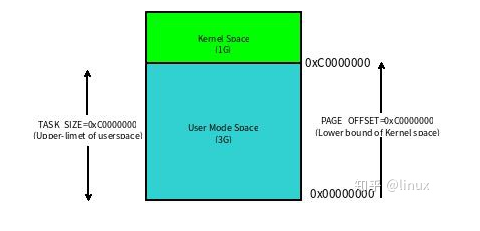
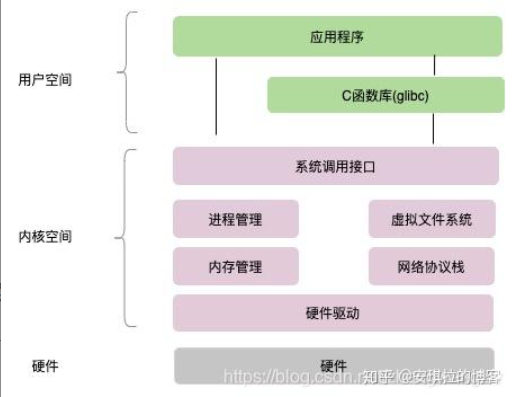
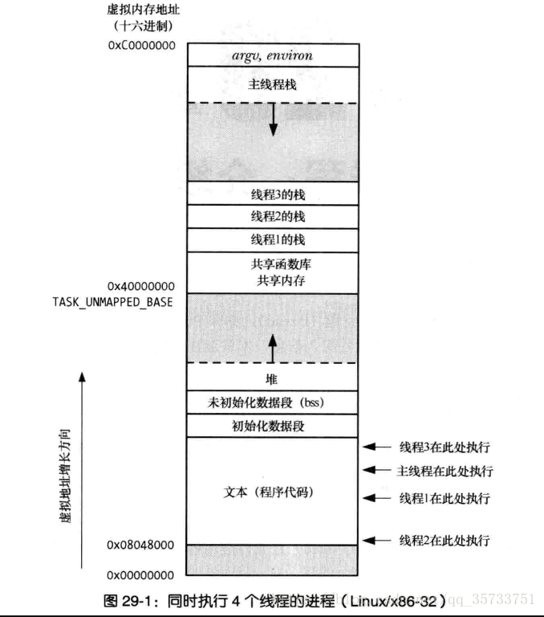

进程与线程

# 前言

我们知道操作系统采用的是虚拟地址空间，以32位操作系统举例，它的寻址空间为4G(2的32次方)，这里解释二个概念:

1. 寻址: 是指操作系统能找到的地址范围，32位指的是地址总线的位数，你就想象32位的二进制数，每一位可以是0，可以是1，是不是有2的32次方种可能，2^32次方就是可以访问到的最大内存空间，也就是4G。
2. 虚拟地址空间：为什么叫虚拟，因为我们内存一共就4G，但操作系统为每一个进程都分配了4G的内存空间，这个内存空间实际是虚拟的，虚拟内存到真实内存有个映射关系。例如X86 cpu采用的段页式地址映射模型。

操作系统将这4G可访问的内存空间分为二部分，一部分是内核空间，一部分是用户空间。

内核空间是操作系统内核访问的区域，独立于普通的应用程序，是受保护的内存空间。

用户空间是普通应用程序可访问的内存区域。

以linux操作系统为例，将最高的1G字节（从虚拟地址0xC0000000到0xFFFFFFFF），供内核使用，称为内核空间，而将较低的3G字节（从虚拟地址0x00000000到0xBFFFFFFF），供各个进程使用，称为用户空间。空间分配如下图所示：



每个进程可以通过系统调用进入内核，因此，Linux内核由系统内的所有进程共享。于是，从具体进程的角度来看，每个进程可以拥有4G字节的虚拟空间。

## **区分内核空间和用户空间原因**

其实早期操作系统是不区分内核空间和用户空间的，但是应用程序能访问任意内存空间，如果程序不稳定常常把系统搞崩溃，比如清除操作系统的内存数据。后来觉得让应用程序随便访问内存太危险了，就按照CPU 指令的重要程度对指令进行了分级，指令分为四个级别：Ring0~Ring3 (和电影分级有点像)，linux 只使用了 Ring0 和 Ring3 两个运行级别，进程运行在 Ring3 级别时运行在用户态，指令只访问用户空间，而运行在 Ring0 级别时被称为运行在内核态，可以访问任意内存空间。

用户态的程序不能随意操作内核地址空间，这样对操作系统具有一定的安全保护作用。

## **说说内核态和用户态**

其实很清晰：**当进程/线程运行在内核空间时就处于内核态，而进程/线程运行在用户空间时则处于用户态。**

在内核态下，进程运行在内核地址空间中，此时 CPU 可以执行任何指令。运行的代码也不受任何的限制，可以自由地访问任何有效地址，也可以直接进行端口的访问。

在用户态下，进程运行在用户地址空间中，被执行的代码要受到 CPU 的很多检查，比如：进程只能访问映射其地址空间的页表项中规定的在用户态下可访问页面的虚拟地址。

我们来看下linux系统的整体结构：



## **用户态到内核态的切换**

如上图所示，所有系统资源的管理都是在内存空间进行的，也就是在内核态去做的，那我们应用程序需要访问磁盘，读取网卡的数据，新建一个线程都需要通过系统调用接口，完成从用户态到内存态的切换。

**当一个任务（进程）执行系统调用而陷入内核代码中执行时，称进程处于内核运行态（内核态）**

除了系统调用可以实现用户态到内核态的切换，还有别的方式吗？ 有，软中断和硬中断。

软中断是指进程发生了异常事件；硬中断就有很多种，例如时钟周期、IO等。

# 内核态和用户态

## 操作系统需要两种CPU状态

内核态（Kernel Mode）：运行操作系统程序，操作硬件

用户态（User Mode）：运行用户程序

## 指令划分

特权指令：只能由操作系统使用、用户程序不能使用的指令。  举例：启动I/O   内存清零  修改程序状态字  设置时钟    允许/禁止终端   停机

非特权指令：用户程序可以使用的指令。  举例：控制转移  算数运算  取数指令   **访管指令**（使用户程序从用户态陷入内核态）

## 特权级别

**特权环：R0、R1、R2和R3**

R0相当于内核态，R3相当于用户态；

不同级别能够运行不同的指令集合；

## CPU状态之间的转换

**用户态--->内核态：**唯一途径是通过中断、异常、陷入机制（访管指令）

**内核态--->用户态：**设置程序状态字PSW

## 内核态与用户态的区别

- 内核态与用户态是操作系统的两种运行级别，当程序运行在3级特权级上时，就可以称之为运行在用户态。**因为这是最低特权级，是普通的用户进程运行的特权级，大部分用户直接面对的程序都是运行在用户态；**

- 当程序运行在0级特权级上时，就可以称之为运行在内核态。

- 运行在用户态下的程序不能直接访问操作系统内核数据结构和程序。当我们在系统中执行一个程序时，大部分时间是运行在用户态下的，在其需要操作系统帮助完成某些它没有权力和能力完成的工作时就会切换到内核态（比如操作硬件）。

- 这两种状态的主要差别是

  > - 处于用户态执行时，进程所能访问的内存空间和对象受到限制，其所处于占有的处理器是可被抢占的
  > - 处于内核态执行时，则能访问所有的内存空间和对象，且所占有的处理器是不允许被抢占的。

## 通常来说，以下三种情况会导致用户态到内核态的切换

- 系统调用

**这是用户态进程主动要求切换到内核态的一种方式**，**用户态进程通过系统调用申请使用操作系统提供的服务程序完成工作。**比如前例中fork()实际上就是执行了一个创建新进程的系统调用。

而系统调用的机制其核心还是使用了操作系统为用户特别开放的一个中断来实现，例如Linux的int 80h中断。

用户程序通常调用库函数，由库函数再调用系统调用，因此有的库函数会使用户程序进入内核态（只要库函数中某处调用了系统调用），有的则不会。

- 异常

当CPU在执行运行在用户态下的程序时，发生了某些事先不可知的异常，这时会触发由当前运行进程切换到处理此异常的内核相关程序中，也就转到了内核态，比如缺页异常。

- 外围设备的中断

**当外围设备完成用户请求的操作后，会向CPU发出相应的中断信号**，这时CPU会暂停执行下一条即将要执行的指令转而去执行与中断信号对应的处理程序，

如果先前执行的指令是用户态下的程序，那么这个转换的过程自然也就发生了由用户态到内核态的切换。比如硬盘读写操作完成，系统会切换到硬盘读写的中断处理程序中执行后续操作等。

**这3种方式是系统在运行时由用户态转到内核态的最主要方式，其中系统调用可以认为是用户进程主动发起的，异常和外围设备中断则是被动的。**

# 用户栈与内核栈

## 进程栈

进程栈是属于用户态栈，和进程 **虚拟地址空间 (Virtual Address Space)** 密切相关。那我们先了解下什么是虚拟地址空间：在 32 位机器下，虚拟地址空间大小为 4G。这些虚拟地址通过页表 (Page Table) 映射到物理内存，页表由操作系统维护，并被处理器的内存管理单元 (MMU) 硬件引用。**每个进程都拥有一套属于它自己的页表，因此对于每个进程而言都好像独享了整个虚拟地址空间。**

Linux 内核将这 4G 字节的空间分为两部分，将最高的 1G 字节（0xC0000000-0xFFFFFFFF）供内核使用，称为 **内核空间**。而将较低的3G字节（0x00000000-0xBFFFFFFF）供各个进程使用，称为 **用户空间**。每个进程可以通过系统调用陷入内核态，因此内核空间是由所有进程共享的。虽然说内核和用户态进程占用了这么大地址空间，但是并不意味它们使用了这么多物理内存，仅表示它可以支配这么大的地址空间。它们是根据需要，将物理内存映射到虚拟地址空间中使用。


### 进程栈的内存布局

Linux 对进程地址空间有个标准布局，地址空间中由各个不同的内存段组成 (Memory Segment)，主要的内存段如下： 

- 程序段 (Text Segment)：可执行文件代码的内存映射 
- 数据段 (Data Segment)：可执行文件的已初始化全局变量的内存映射 
- BSS段 (BSS Segment)：未初始化的全局变量或者静态变量（用零页初始化） 
- 堆区 (Heap) : 存储动态内存分配，匿名的内存映射 
- 栈区 (Stack) : 进程用户空间栈，由编译器自动分配释放，存放函数的参数值、局部变量的值等 
- 映射段(Memory Mapping Segment)：任何内存映射文件




而上面进程虚拟地址空间中的栈区，正指的是我们所说的进程栈**。进程栈的初始化大小是由编译器和链接器计算出来的，但是栈的实时大小并不是固定的，Linux
 内核会根据入栈情况对栈区进行动态增长（其实也就是添加新的页表）。但是并不是说栈区可以无限增长，它也有最大限制 RLIMIT_STACK 
(一般为 8M)，我们可以通过 ulimit 来查看或更改 RLIMIT_STACK的值。

上面对进程的地址空间有个比较全局的介绍，那我们看下 Linux 
内核中是怎么体现上面内存布局的。内核使用内存描述符来表示进程的地址空间，该描述符表示着进程所有地址空间的信息。内存描述符由 mm_struct 
结构体表示，下面给出内存描述符结构中各个域的描述，请大家结合前面的 进程内存段布局 图一起看：

```c
struct mm_struct {
    struct vm_area_struct *mmap;           /* 内存区域链表 */
    struct rb_root mm_rb;                  /* VMA 形成的红黑树 */
    ...
    struct list_head mmlist;               /* 所有 mm_struct 形成的链表 */
    ...
    unsigned long total_vm;                /* 全部页面数目 */
    unsigned long locked_vm;               /* 上锁的页面数据 */
    unsigned long pinned_vm;               /* Refcount permanently increased */
    unsigned long shared_vm;               /* 共享页面数目 Shared pages (files) */
    unsigned long exec_vm;                 /* 可执行页面数目 VM_EXEC & ~VM_WRITE */
    unsigned long stack_vm;                /* 栈区页面数目 VM_GROWSUP/DOWN */
    unsigned long def_flags;
    unsigned long start_code, end_code, start_data, end_data;    /* 代码段、数据段 起始地址和结束地址 */
    unsigned long start_brk, brk, start_stack;                   /* 栈区 的起始地址，堆区 起始地址和结束地址 */
    unsigned long arg_start, arg_end, env_start, env_end;        /* 命令行参数 和 环境变量的 起始地址和结束地址 */
    ...
    /* Architecture-specific MM context */
    mm_context_t context;                  /* 体系结构特殊数据 */

    /* Must use atomic bitops to access the bits */
    unsigned long flags;                   /* 状态标志位 */
    ...
    /* Coredumping and NUMA and HugePage 相关结构体 */
};

```

### 进程栈的动态增长

进程在运行的过程中，通过不断向栈区压入数据，当超出栈区容量时，就会耗尽栈所对应的内存区域，这将触发一个 **缺页异常 (page fault)**。通过异常陷入内核态后，异常会被内核的 expand_stack() 函数处理，进而调用 acct_stack_growth() 来检查是否还有合适的地方用于栈的增长。
如果栈的大小低于 RLIMIT_STACK（通常为8MB），那么一般情况下栈会被加长，程序继续执行，感觉不到发生了什么事情，这是一种将栈扩展到所需大小的常规机制。然而，如果达到了最大栈空间的大小，就会发生 **栈溢出（stack overflow）**，进程将会收到内核发出的 **段错误（segmentation fault）** 信号。
动态栈增长是唯一一种访问未映射内存区域而被允许的情形，其他任何对未映射内存区域的访问都会触发页错误，从而导致段错误。一些被映射的区域是只读的，因此企图写这些区域也会导致段错误。

## 线程栈

从 Linux 内核的角度来说，其实它并没有线程的概念。Linux 把所有线程都当做进程来实现，它将线程和进程不加区分的统一到了 task_struct 中。线程仅仅被视为一个与其他进程共享某些资源的进程，而是否共享地址空间几乎是进程和 Linux 中所谓线程的唯一区别。线程创建的时候，加上了 CLONE_VM 标记，这样 **线程的内存描述符 将直接指向 父进程的内存描述符**。

```c
if (clone_flags & CLONE_VM) {
    /*
     * current 是父进程而 tsk 在 fork() 执行期间是共享子进程
     */
    atomic_inc(¤t->mm->mm_users);
    tsk->mm = current->mm;
  }
```

虽然线程的地址空间和进程一样，但是对待其地址空间的 stack 还是有些区别的。对于 Linux 进程或者说主线程，其 stack 是在 fork 的时候生成的，实际上就是复制了父亲的 stack 空间地址，然后写时拷贝 (cow) 以及动态增长。然而对于主线程生成的子线程而言，其stack 将不再是这样的了，而是事先固定下来的，使用 mmap 系统调用，它不带有 VM_STACK_FLAGS 标记。这个可以从 glibc 的nptl/allocatestack.c 中的 allocate_stack() 函数中看到：

```c
mem = mmap (NULL, size, prot, MAP_PRIVATE | MAP_ANONYMOUS | MAP_STACK, -1, 0);
```

由于线程的 mm->start_stack 栈地址和所属进程相同，所以线程栈的起始地址并没有存放在 task_struct 中，应该是使用 pthread_attr_t 中的 stackaddr 来初始化 task_struct->thread->sp（sp 指向 struct pt_regs 对象，该结构体用于保存用户进程或者线程的寄存器现场）。这些都不重要，重要的是，**线程栈不能动态增长，一旦用尽就没了，这是和生成进程的 fork 不同的地方**。由于线程栈是从进程的地址空间中 map 出来的一块内存区域（映射在用户栈，自底向上生长，根据多线程模型，在内核空间建立相应的栈），原则上是线程私有的。但是同一个进程的所有线程生成的时候浅拷贝生成者的 task_struct 的很多字段，其中包括所有的 vma，如果愿意，其它线程也还是可以访问到的，于是一定要注意。

## 进程内核栈

内核在创建进程的时候，在创建task_struct的同时，会为进程创建两个栈，第一个栈也就是上面分析到的进程用户栈，存在于用户空间使用，另外还有一个内核栈，存放在内核空间。**内核栈存在的意义：**如系统调用在陷入内核后，系统调用中也是存在函数调用和自动变量，这些都需要栈支持。当进程A要切换到进程B时，首先要陷入内核，然后内核将CPU中关于进程A的进程信息（即某些寄存器中的值）保存在进程A的内核栈中，然后从进程B的内核栈中恢复进程B的信息到CPU的某些寄存器中，再退出内核模式回到进程B，这样CPU就开始执行进程B了。


## Linux 为什么需要区分这些栈？

为什么需要区分这些栈，其实都是设计上的问题。这里就我看到过的一些观点进行汇总，供大家讨论（博客上的原话）：

1. 为什么需要单独的进程内核栈？所有进程运行的时候，都可能通过系统调用陷入内核态继续执行。假设第一个进程 A 陷入内核态执行的时候，需要等待读取网卡的数据，主动调用 schedule() 让出 CPU；此时调度器唤醒了另一个进程 B，碰巧进程 B 也需要系统调用进入内核态。那问题就来了，如果内核栈只有一个，那进程 B 进入内核态的时候产生的压栈操作，必然会破坏掉进程 A 已有的内核栈数据；一但进程 A 的内核栈数据被破坏，很可能导致进程 A 的内核态无法正确返回到对应的用户态了；

2. 为什么需要单独的线程栈？Linux 调度程序中并没有区分线程和进程，当调度程序需要唤醒”进程”的时候，必然需要恢复进程的上下文环境，也就是进程栈；但是线程和父进程完全共享一份地址空间，如果栈也用同一个那就会遇到以下问题。假如进程的栈指针初始值为 0x7ffc80000000；父进程 A 先执行，调用了一些函数后栈指针 esp 为 0x7ffc8000FF00，此时父进程主动休眠了；接着调度器唤醒子线程 A1：
   此时 A1 的栈指针 esp 如果为初始值 0x7ffc80000000，则线程 A1 一但出现函数调用，必然会破坏父进程 A 已入栈的数据。如果此时线程 A1 的栈指针和父进程最后更新的值一致，esp 为 0x7ffc8000FF00，那线程 A1 进行一些函数调用后，栈指针 esp 增加到 0x7ffc8000FFFF，然后线程 A1 休眠；调度器再次换成父进程 A 执行，那这个时候父进程的栈指针是应该为 0x7ffc8000FF00 还是 0x7ffc8000FFFF 呢？无论栈指针被设置到哪个值，都会有问题不是吗？

3. 进程和线程是否共享一个内核栈？No，线程和进程创建的时候都调用 dup_task_struct 来创建 task 相关结构体，而内核栈也是在此函数中 alloc_thread_info_node 出来的。因此虽然线程和进程共享一个地址空间 mm_struct，但是并不共享一个内核栈。

