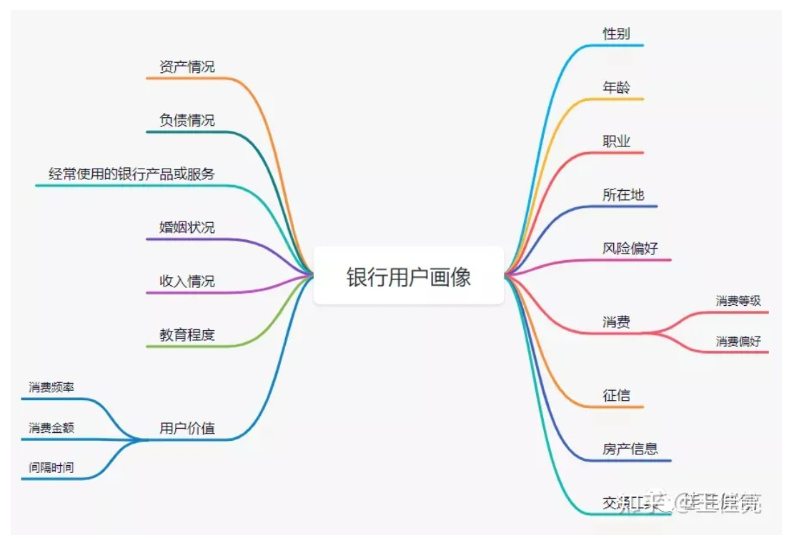
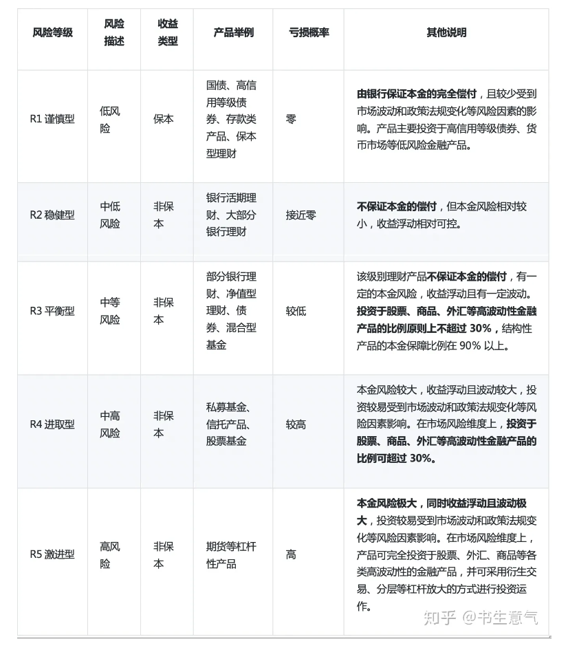
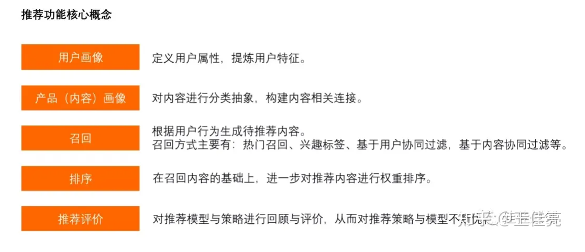
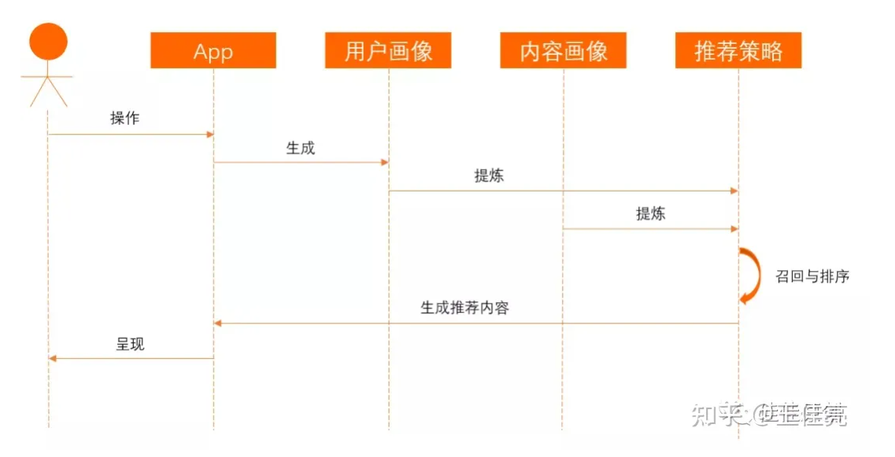
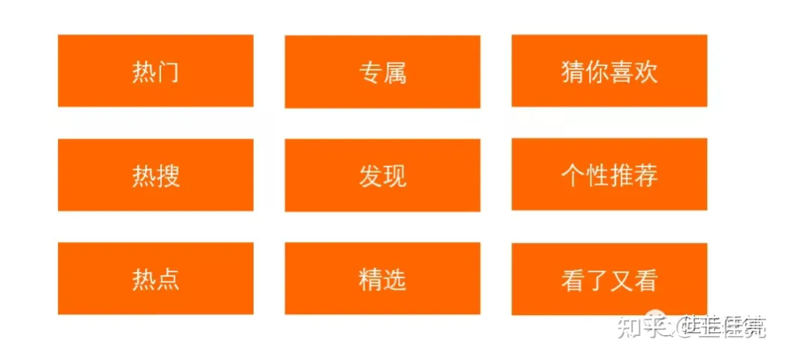

金融行业的用户画像与推荐系统调研

# **金融产品用户画像设计的三大重点**

用户画像设计要坚持三个原则，分别是：人口属性和信用信息为主，强相关信息为主，定性数据为主。

**信用信息和人口属性为主**

描述一个用户的信息很多，信用信息是用户画像中重要的信息，信用信息是描述一个人在社会中的消费能力信息。信用信息可以直接证明客户的消费能力，是用户画像中最重要和基础的信息。包含消费者工作、收入、学历、财产等信息。

再次，金融企业需要触达客户，人口属性信息就是起到触达客户的作用，人口属性信息包含：姓名、性别，电话号码，邮件地址，家庭住址等。这些信息可以帮助金融企业联系客户，将产品和服务推销给客户。

**采用强相关信息，忽略弱相关信息**

强相关信息：是同场景需求直接相关的信息，其可以是因果信息，也可以是相关程度很高的信息。

例如：分析发现在其他条件相同的前提下，35岁左右人的平均工资高于平均年龄为30岁的人，计算机专业毕业的学生平均工资高于哲学专业学生，从事金融行业工作的平均工资高于从事纺织行业的平均工资，上海的平均工资超过海南省平均工资。

从这些信息告诉我们人的年龄、学历、职业、地点对收入的影响较大，同收入高低是强相关关系。也代表对信用属性影响较大的信息就是强相关信息，反之是弱相关信息。

用户其他的信息，如用户的身高、体重、姓名、星座等信息，很难从概率上分析出其对消费能力的影响，是弱相关信息。

这些信息不放入用户画像中进行分析，对用户的信用消费能力影响很小，不具商业价值。

**转定量信息为定性的信息**

定量的信息不利于对客户进行筛选，需要将定量信息转化为定性信息，通过信息类别来筛选人群。

如：将年龄段划分的客户转化为定性信息

18岁-25岁定义为年轻人，25岁-35岁定义为中青年，36-45定义为中年人等。

参考个人收入信息，将人群定义为高收入人群，中等收入人群，低收入人群。

参考资产信息也可将客户定义为高、中、低级别。

将金融企业各类定量信息集中做定性信息的分类，定性化有利与对用户进行筛选，快速定位目标客户。

## ***总结***

金融企业结合业务需求进行用户画像，从实用角度出发可以将用户画像信息分成五类信息。分别是：人口属性，信用属性，消费特征，兴趣爱好，社交属性。

它们基本覆盖了业务需求所需要的强相关信息，结合外部场景数据将会产生巨大的商业价值。我们先了解下用户画像的五大类信息的作用，以及涉及的强相关信息。

**人口属性**

用于描述一个人基本特征的信息，主要作用是帮助金融企业知道客户是谁，如何触达用户，属于人口属性的信息包括：

- 姓名
- 性别
- 年龄
- 电话号码
- 邮箱
- 家庭住址

**信用属性**

用于描述用户收入潜力和收入情况，支付能力。帮助企业了解客户资产情况和信用情况，有利于定位目标客户，属于信用属性的信息包括：

- 客户职业
- 收入
- 资产
- 负债
- 学历
- 信用评分

**消费特征**

用于描述客户主要消费习惯和消费偏好，用于寻找高频和高价值客户。帮助企业依据客户消费特点推荐相关金融产品和服务，转化率将非常高。为了便于筛选客户，可以参考客户的消费记录将客户直接定性为某些消费特征人群，例如：

- 差旅人群
- 境外游人群
- 旅游人群
- 餐饮用户
- 汽车用户
- 母婴用户
- 理财人群

**兴趣爱好**

描述客户具有哪方面的兴趣爱好，帮助企业了解客户兴趣和消费倾向，定向进行活动营销。

兴趣爱好的信息可能会和消费特征中部分信息有重复，区别在于数据来源不同。消费特征来源于已有的消费记录，但是购买的物品和服务不一定是自己享用，但是兴趣爱好代表本人的真实兴趣，兴趣爱好的信息可能来源于社交信息和客户位置信息。例如：

- 户外运动爱好者

- 旅游爱好者

- 电影爱好者

- 科技发烧友

- 健身爱好者

- 奢侈品爱好者

## 解决方案

由于我们没有真实的数据，所以我们能拥有的数据，大概率是从相关的比赛里抽取。所以在这一个任务里，我们的边界，就是定义好我们目前的功能，需要展示哪些属性，与推荐系统的交互需要哪些属性。把这个功能做成一个前后端的系统，向前端返回需要展示数据，向推荐系统传递需要的参数。把这些数据写死到mysql，同时做好前后端各自的解耦和拓展性。（前端需要展示的数据可能会需要变化，后端的话，有一些属性，比如用户画像里的一些数据，客户信用评分，客户风险等级，这些是需要大数据端和算法进行计算才能得到的，所以后续这个功能可能需要拓展，算法和大数据的工作会接入这个功能）。

用户基本信息/ 财务状况/风险偏好/风险承受能力/客户信用评分

# 金融产品的推荐策略

有了用户画像之后， 我们就可以根据用户画像的结果，对用户进行分类，建立相应的客群。

同理，也应该有银行产品的画像。但是由于我们缺少数据，我们这一次就不涉及这一块了。

在国内，一般银行将理财产品风险由低到高分为 R1（谨慎型）、R2（稳健型）、R3（平衡型）、R4（进取型）、R5（激进型）五个级别。

## 银行产品中使用推荐策略

推荐策略相关的核心概念。

银行产品推荐策略的实现流程。

## 推荐策略在银行产品的呈现方式

推荐策略完成了向用户推荐内容的计算，最后一步就是向用户呈现推荐结果。通常推荐结果的呈现方式如下图所示。

我的理解是不同的呈现方式，其实是对应不同的召回通道。例如，热门的这一系列产品应该是大数据端，计算近期的数据得到的，专属这一列是由协同过滤（基于用户和产品的匹配度来得出），个性化推荐由用户近期的行为和偏爱进行推荐。

## 解决方案

我们现有的系统是一个金融行业的数据分析系统和产品推荐系统。我们的用户画像目前是生成的，并且计算哪些维度，有哪些属性是不明确的。所以这里就把业务流程和数据写死，后面再迭代开发。用户画像需要一个客户风险等级（消费能力、和偏好类型激进型还是稳健性）和客户信用评分（直接生成）。

推荐从几个方面推荐：

- 热点数据，大数据方面的计算结果，这里可以拓展新的功能和业务线
- 由于金融产品的特殊性，通常来说，会更加稳定，属性不会轻易改变，某一个类型的产品不会轻易改变它的类型。并且和客户的消费能力及风险评级是强关联的。所以根据产品的类型，建立不同的推荐池（某一个推荐池里的商品和用户的特征进行交互，得出推荐的商品，用户的偏好在这里体现）。获得不同推荐池里的商品以后再进行排序。